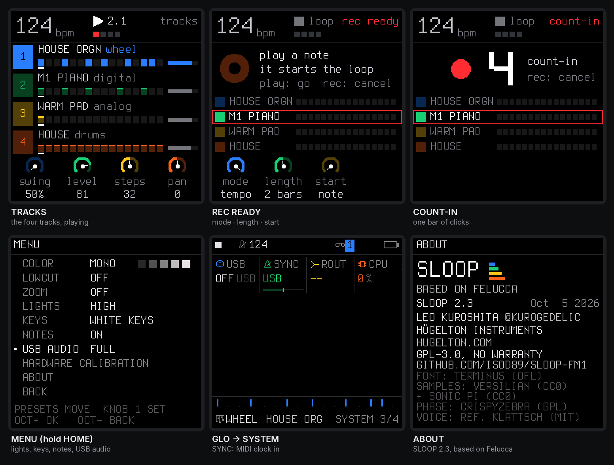

<b>A live groovebox firmware for the M-VAVE FM-1 — for any style.</b> 
Free and open source (GPL-3.0), based on <a href="https://github.com/hugelton/Felucca">Felucca</a> by Leo Kuroshita / Hügelton Instruments.

<a href="https://shifl.netlify.app/"><b>Web editor</b></a> ·
<a href="SHIFL.md">Manual</a> ·
<a href="DEMARRAGE-RAPIDE-FR.md">Guide en français</a> ·
<a href="../../releases">Releases</a> ·
<a href="../../issues">Report a bug</a>

---

SHIFL turns the FM-1 into a six-track groovebox you play live: **five synths and a drum machine** with 16 sounds on the white keys, 116 sounds across five engines — DX7 FM, virtual analogue, Phase Distortion (CZ-1), formant voice and lo-fi chip — three drum kits, your own samples, a song mode you play with your hands — and **USB audio**, a **MIDI keyboard on the jack**, **MIDI CC control**, **MIDI clock**, **lights for playing in the dark** and a **full backup**. House, techno, hip-hop, trap, drum & bass, amapiano, synthwave, lo-fi, ambient, chiptune — it does not pick a style for you. No factory patterns, nothing to load: everything you hear, you play.

> **Status:** 2.4. Still a beta: install at your own risk, and please [report](../../issues) what you find. Your projects, presets, samples and settings are kept when you update, and you can go back at any time (see [Going back](#going-back)).

## Contents

1. [What's new in 2.4](#whats-new-in-24)
2. [Screenshots](#screenshots)
3. [Features](#features)
4. [Presets](#presets)
5. [MIDI CC reference](#midi-cc-reference)
6. [Install](#install)
7. [Your first beat in 60 seconds](#your-first-beat-in-60-seconds)
8. [The controls](#the-controls)
9. [The menu: settings of the FM-1](#the-menu-settings-of-the-fm-1)
10. [MIDI and USB audio](#midi-and-usb-audio)
11. [The web editor](#the-web-editor)
12. [Compatibility](#compatibility)
13. [Troubleshooting](#troubleshooting)
14. [Specifications](#specifications)
15. [Documentation](#documentation)
16. [Building and tests](#building-and-tests)
17. [Contributing](#contributing)
18. [Credits and thanks](#credits-and-thanks)
19. [Licence](#licence)

---

## What's new in 2.4

| | |
| --- | --- |
| **New sound engine** | Replaced the internal audio engines with fmsloop's sound engine. All presets are rebuilt around it: 116 sounds across five engines (DX7 FM, virtual analogue, Phase Distortion, formant voice, lo-fi chip) and three drum kits with 17 voices each. |
| **CZ-1 presets** | 65 Casio Phase Distortion presets: one init tone and the 64 Casio factory tones across banks A–D (BRASS, STRINGS, PIANO, ORGAN, SYNTH.LEAD and more), faithful to the original CZ-1. |
| **32 punch-in effects** | The PUNCH FX page now has two pages of 16 effects. Page 1 is on the physical white keys as before. Page 2 (LPF sweeps, retrigger, shuffle, octave down, scratch, vibrato, glitch, feedback, distort, blinds) is accessible via MIDI CC. |
| **MIDI CC control** | A hardware controller can now drive the FM-1 in real time: per-track filter cutoff and resonance (CC 74 / 71 on channels 1–3), global effects (swing, delay, reverb, chorus on channel 16), master DJ filter and DUST, and all 32 PUNCH effects as momentary pads (CC 102–133 on channel 16). See [MIDI CC reference](#midi-cc-reference). |
| **Step probability** | Each step on a synth track can fire at 100 %, 75 %, 50 % or 25 % chance per pass. Drum lanes support the same — certain hits, probabilistic hits and ratchets from a single per-lane dial (shown as `on` / `P75` / `P50` / `P25` / `×2` / `×3` / `×4`). |
| **Six tracks** | Two additional synth tracks, for a total of five synths and a drum track (six tracks). |
| **Drums with the keys** | The drum track can now be played on the keyboard keys, the same way as a synth track. |
| **Song mode depth** | Each arrangement fragment is now independent (its own state, not a shared scene). Fragments can carry: a **key / root change**, **in-key transposition** (diatonic snap instead of chromatic), **per-track patch overrides** (change engine + preset mid-song for any track), and **FX overrides** (reverb / delay settings change as the song progresses). |
| **Dotted steps and delays** | The step sequencer gains dotted 1-measure and dotted 2-measure step lengths; fragments can be half a measure. The delay adds dotted 1/4 and dotted 1/8 as time options. |

What came in 2.0–2.3 (USB audio, TRS MIDI in, MIDI clock, lights, backup): [SHIFL.md](SHIFL.md#new-in-24). Release notes: [Releases](../../releases).

## Screenshots

The FM-1's screen: the tracks, the REC screen and its count-in, the menu (lights and USB audio), MIDI clock, about.

Start-up, the four tracks (recording), the drum grid and a drum kit, the sounds by kind, the layers (punch-in FX, steps, key and chords, mix, erase), a free take, the FX sends.

The web editor: the drum track as a 16-lane grid, with levels and ratchets.

CHOP: a 20 s recording cut into 16 chops, 8 kept, fitted to the slot.

## Features

### Play it live: hold a button, touch a key

Every function button is a **layer**: hold it and the 16 white keys and the four knobs change job, and the screen shows how. Tap it and its pages open. Hold a layer button and tap HOME to **lock** it open, both hands free.

| Hold | The white keys | KNOB 1 · 2 · 3 · 4 |
| --- | --- | --- |
| **FX** — punch | 16 punch-in effects on the whole mix (page 1 of 32): loops 1/4–1/32, oct up, stop, slap, echo tails, phone filter, bit crush, alias, gate | FILTER · DUST · DUCK |
| **EDIT** — erase | erase a sound or a note as the loop plays (stopped: from the whole pattern) | SHIFT · LENGTH ×2 / ½ · TRANSPOSE |
| **ARP** — roll | note repeat on the grid, recorded as ratchets | RATE (1/8 … 1/64) |
| **SEQ** — steps | the 16 steps of the page, with a level, ratchet and probability per step | SOUND / NOTE · DIV · SWING · LENGTH |
| **SCL** — key | the key of the song | CHORD · SCALE · KEYS · TRANSPOSE |
| **GLO** — mix | 1–4 mute, 5–8 solo, 16 tap tempo | the levels of tracks 1–6 |
| **SAVE** — song | 1–4 play sections A–D, 5–8 save the loop into them, 13 loop / song, 14 record the song, 16 the chain | — |

Keys 1, 5, 9 and 13 glow dimly while a layer is held: the first key of each row of the 4 × 4 grid on the screen. **EDIT + OCT− / OCT+** is undo / redo.

### Drums

- **16 sounds on the white keys**, kick to cowbell; a black key doubles the white key on its left (fast rolls with two fingers).
- **Play drums on the keys:** the drum track responds to the keyboard like a synth track — hold a key, it plays that drum voice pitched.
- **Ghost and hard hits:** hold OCT− / OCT+ while you play. Every hit keeps its level (GHOST, SOFT, NORM, HARD) and a **ratchet** (×1–×4).
- **Step probability per lane:** each drum step can be certain, or fire at 75 %, 50 % or 25 % chance. The dial cycles: `--` / `on` / `P75` / `P50` / `P25` / `×2` / `×3` / `×4`. Ratchets only apply on lanes that actually fired.
- **3 kits, 17 voices each**, all level-matched: 808 FM, ELECTRO and METAL, each voice built like on the classic machines; softer hits are darker as well as quieter.
- **Grid and kit pages** on the FM-1 (EDIT or SEQ on the drum track), and a 16-lane grid in the web editor.

### Synths and sounds

- **Five engines:** DX7 FM synthesis, virtual analogue (two oscillators, filter, drive), Casio CZ-1 Phase Distortion, formant voice, lo-fi chip.
- **116 sounds, browsed by kind** — all level-matched. **32 slots** for your own presets.
- Envelopes (with a pitch punch for 808-style kicks), LFO, arpeggiator, glide and voice modes (POLY, MONO, LEGATO, UNISON), per-track drive and slicer, sends to a **stereo chorus**, a **tempo delay** and a **stereo reverb**.
- **Key and chords (SCL):** the key of the song for all synths, 16 scales, one-key chords (triad, 7th, 9th, sus4, power), keys snapped to the scale or the scale on the white keys.

### Recording and the sequencer

- **Records as you play, no click needed:** while it plays, REC records at once and every pass is added on top (overdub). Notes land where you heard them: the ~12 ms of the keys are taken back.
- **The REC screen:** **mode** *free* — no tempo, no grid: play, press REC on the "1" after your last bar, and the loop's length sets the tempo — or *tempo* — record at the tempo you set; **length** 1, 2 or 4 bars; **start** on your first note, or after a one-bar **count-in**.
- **Hold REC ~2 s** to clear a track; **undo / redo** brings it back.
- **64 steps per track**, each track with its own length and division (polymeters stay in phase); chords up to 4 notes a step, ties, slide; **MPC swing** 50–75 %; one sample-accurate clock for everything.
- **Step lengths:** 1/32 … 1/1, plus dotted values including dotted 1-measure and dotted 2-measure; fragments can be half a measure. Triplet and odd subdivisions keep polymeters in phase.
- **Step probability:** each step on a synth track fires at 100 %, 75 %, 50 % or 25 % chance per pass. Drum lanes add the same control.
- The PLAY light flashes on every beat (a visual metronome); an audible click is in GLO → GLOBAL → CLICK and is never recorded.

### Songs

Save up to four sections **A–D** (SAVE + keys 5–8), play them live on the next bar (SAVE + keys 1–4), and **record the song as you play it** (SAVE + key 14). In song mode PLAY plays the whole chain. The SONG screen edits it by hand.

Each arrangement fragment is independent and can carry its own overrides:

- **Key change** — sets the root at that point in the arrangement.
- **In-key transposition** — CHR mode: chromatic semitone shift; KEY mode: snaps the transpose to the nearest note in the current scale (diatonic transposition).
- **Per-track patch overrides** — change the engine and preset for any track at any fragment, without touching the others.
- **FX overrides** — reverb and delay settings change as the song progresses.

### Effects and master

- **32 punch-in effects** across two pages (FX + a key):
  - **Page 1** (white keys, always): LOOP 4, LOOP 8, LOOP 16, LOOP 32, OCT UP, STOP F, STOP S, SLAP, ECHO L, ECHO 2, ECHO, PHONE, CRUSH, ALIAS, GATE, GATE 2
  - **Page 2** (MIDI CC 118–133): LPF SLW, LPF FST, LPF DWN, LPF UP, RETRIG, RETRIG F, STUT L, STUT LL, SHUF, OCT DN, SCRATCH, VIBRATO, GLITCH, FEEDBK, DISTORT, BLINDS
- All effects are beat-synced to the tempo; loops start on the grid.
- **Delay:** dotted 1/4 and dotted 1/8 are available as delay time options.
- **Master:** **DUST** (old sampler and record: bits, rate, crackle), **DUCK** (the kick pumps the synths), **FILT** (a DJ filter: low-pass ← off → high-pass), and an output limiter.

### Your own samples

- **Three slots** (USR1–USR3) of about 7.4 s each, played by a synth track; up to 16 WAV files per slot, each on its own key.
- **CHOP** in the web editor: open or drop a recording (WAV, MP3, AIFF…) of **any length**, tap along while it plays (each tap snaps to its hit), or find the hits, a tempo grid, equal parts; keep the chops you want, shorten them or **Fit to slot**; send them to a slot, one per key, or download them as WAV files.

### MIDI

- **USB MIDI** in and out, class compliant.
- **TRS MIDI IN** (the 3.5 mm jack) for a keyboard or a pad controller.
- **MIDI clock in** (USB or TRS): tempo, START, CONTINUE, STOP.
- **MIDI CC control:** real-time parameter control from a hardware controller — filter, FX, swing, punch-in effects. See [MIDI CC reference](#midi-cc-reference).
- Details: [MIDI and USB audio](#midi-and-usb-audio).

### USB audio

The FM-1 is also a **USB audio input**: record its master output on a computer, no driver, over the same cable as MIDI and the editor. Details: [USB audio](#usb-audio-record-the-fm-1-on-a-computer).

### Lights for playing in the dark

Every button can glow so its label is readable on a black FM-1; the C keys or every white key can glow too; the notes playing can light their keys. Details: [The menu](#the-menu-settings-of-the-fm-1).

### Memory and safety

- **Autosave:** stop and leave it 2.5 s, your work is kept; at power-on SHIFL comes back exactly as you left it.
- **4 projects**, **32 user presets**, **undo / redo**.
- **Full backup and restore** from the web editor.
- **Safe updates:** the installer checks the package (SHA-256) before writing it, the update loader checks it again (CRC) before starting it; an interrupted install finishes when you press Install again; **USB rescue** (OCT− at power-on).

---

## Presets

### ANALOG — virtual analogue (22 presets)

808 BOOM, 808 DIRTY, SUB BASS, 808 SLIDE, ACID 303, PLUGG BASS, REESE, WOBBLE, FUNK BASS, G-FUNK LD, TRAP PLUCK, SYN BRASS, SUPERSAW, WARM PAD, DARK STR, ATMOS PAD, PAN FLUTE, FAT LEAD, MONO BASS, PWM LEAD, SAW BASS, SINE PAD

### DX7 — FM synthesis (20 presets)

EPIANO 1, EPIANO 2, FM BASS, SLAP BASS, SUB BASS, BRASS, STRINGS, GLASS PAD, BELLS, MARIMBA, ORGAN, CLAV, PLUCK, FLUTE, SAW LEAD, KOTO, DEEP SUB, 808 SUB, REESE, INIT VOICE

### LOFI — lo-fi chip (5 presets)

PULSE LD, WAVE BASS, ARP 8BIT, WAVE LEAD, STEP LEAD

### VOICE — formant (4 presets)

CHOIR AAH, VOX LEAD, WOW BASS, WHISPER

### CZ-1 — Casio Phase Distortion (65 presets)

1 init tone + 64 Casio factory tones across banks A–D:

**Bank A:** BRASS 1, BRASS 2, BRASS 3, STRINGS 1, STRINGS 2, STRINGS 3, STRINGS 4, ORCHESTRA, ACO.GUITAR, JAZZ GUITAR, ELEC.GUITAR, SLAP BASS, SYNTH.BASS, ELEC.BASS 1, ELEC.BASS 2, HARP

**Bank B:** BRASS 4, SAXOPHONE, CELLO, FLUTE, WHISTLE, HARMONICA, RECORDER, KOTO, PIANO 1, PIANO 2, PIANO 3, ELEC.PIANO, HONKY-TONK, FUNKY CLAV 1, FUNKY CLAV 2, HARPSICHORD

**Bank C:** JAZZ ORGAN 1, JAZZ ORGAN 2, PIPE ORGAN 1, PIPE ORGAN 2, ACCORDION, VOICE 1, VOICE 2, VOICE 3, MUSIC BOX, VIBRAPHONE, XYLOPHONE, MARIMBA, MALLET LOG, AFRO PERC, BELLS, METALLIC

**Bank D:** SYN STRINGS, FAT ENSEMBLE, SITAR, SYNTH.LEAD 1–4, SWEEP 1, SYN DRUMS 1, SYN DRUMS 2, CONGA, STEEL DRUM, SWEEP 2, JET ROAR, MOTORCYCLE, TYPHOON

### Drum Kits (3 kits, 17 voices each)

**808 FM:** KICK 808, KICK 808 S, SNARE 808, CLAP 808, HAT 808, OHAT 808, PHAT 808, RIM 808, SNR 808 HI, TOM 808 L, TOM 808 H, CYM 808, RIDE 808, MARACA, CONGA 808, COWB 808, CLAVE

**ELECTRO:** KICK EL, KICK HARD, SNARE EL, CLAP EL, HAT EL, OHAT EL, PHAT EL, RIM EL, SNAP EL, TOM EL L, TOM EL H, CRASH EL, RIDE EL, SHAKE EL, ZAP, BLIP, CLAVE

**METAL:** KICK MTL, KICK MTL 2, CLANG, CLAP MTL, HAT MTL, OHAT MTL, PHAT MTL, ANVIL, ANVIL SNR, BELL TOM L, BELL TOM H, GONG, BELL RIDE, CHAIN, PIPE, BELL, CLAVE

---

## MIDI CC reference

Program a hardware controller to control the FM-1 in real time. All channels are 1-indexed as on the controller.

### Per-track filter (channels 1–3)

Each synth track responds on its own channel. On the DX7 engine, cutoff controls FM index and carrier ratio; on CZ-1 it controls phase depth.

| CC | Parameter |
| --- | --- |
| **71** | Filter resonance |
| **74** | Filter cutoff |

### Global FX (channel 16)

| CC | Parameter | Notes |
| --- | --- | --- |
| **20** | Swing | 0–100 (clamped) |
| **24** | Delay feedback | 0–127 |
| **25** | Delay color | 0–127 |
| **26** | Delay mix | 0–127 |
| **27** | Reverb size | 0–127 |
| **28** | Reverb damp | 0–127 |
| **29** | Chorus rate | 0–127 |
| **30** | Chorus depth | 0–127 |
| **71** | Master DUST (lo-fi) | 0–127 |
| **74** | Master DJ filter | 64 = off, 0–63 = LP, 65–127 = HP |

### PUNCH FX — page 1 (channel 16, CC 102–117, momentary)

Send value 127 (held) and 0 (released). Only one effect active at a time; a new nonzero CC replaces the previous one.

| CC | Effect | CC | Effect |
| --- | --- | --- | --- |
| 102 | LOOP 4 | 110 | FLANGE / ECHO L |
| 103 | LOOP 8 | 111 | ECHO 2 |
| 104 | LOOP 16 | 112 | PHONE |
| 105 | LOOP 32 | 113 | CRUSH |
| 106 | OCT UP | 114 | ALIAS |
| 107 | STOP F | 115 | GATE |
| 108 | STOP S | 116 | ECHO |
| 109 | SLAP | 117 | GATE 2 |

### PUNCH FX — page 2 (channel 16, CC 118–133, momentary)

| CC | Effect | CC | Effect |
| --- | --- | --- | --- |
| 118 | LPF SLW | 126 | SHUF |
| 119 | LPF FST | 127 | OCT DN |
| 120 | LPF DWN | 128 | SCRATCH |
| 121 | LPF UP | 129 | VIBRATO |
| 122 | RETRIG | 130 | GLITCH |
| 123 | RETRIG F | 131 | FEEDBK |
| 124 | STUT L | 132 | DISTORT |
| 125 | STUT LL | 133 | BLINDS |

### Drum triggers (channel 10)

No CC needed — note-on on channel 10 triggers the drum sounds by nearest note, as always. Map pads to the 16 drum pitches for the loaded kit.

The full CC reference card is in [docs/midi-cc-plan.md](docs/midi-cc-plan.md).

---

## Install

### From the browser (recommended)

1. Open **[the SHIFL web editor](https://shifl.netlify.app/)** in **Chrome or Edge** on a computer.
2. Connect the FM-1 by USB — a **data** cable, directly (no hub).
3. Press **INSTALL**, allow MIDI access, and wait for *Done*. The FM-1 restarts on the SHIFL logo.

Nothing to download or compile. Your projects, user presets, samples and settings are kept. After an install, **unplug and plug the FM-1 back in** once so the computer finds its USB audio input.

### Other ways

- **SysEx app:** download the `.fwsc` from a [release](../../releases) and send it to the FM-1 with any SysEx tool — [SysEx Librarian](https://www.snoize.com/sysexlibrarian/) (macOS), a browser-based SysEx sender, or similar. The FM-1 must be connected by USB; send to its MIDI port.
- **Python:** the `.fwsc` of a [release](../../releases) with `python tools/fm1_install.py shifl-2.4.fwsc` (needs `pip install mido python-rtmidi`).
- **Build it yourself:** see [Building and tests](#building-and-tests); on Windows, `INSTALL-SHIFL.bat` builds SHIFL and opens the installer locally.

### Going back

- **To an earlier SHIFL:** install the `.fwsc` of its [release](../../releases). It keeps your work and simply ignores the 2.4 settings.
- **To the official firmware:** on the installer page, open **Return to the official firmware (V15)**. Save a backup with the editor first, download FM-1 V15 from m-vave.com and select its `FM-1.fwsc` — only that exact file is accepted. M-VAVE's updater, M-UPGRADE, works too. To come back, install SHIFL again and restore your backup.

### Rescue

- **The FM-1 no longer starts SHIFL:** hold **OCT−** alone while switching it on (*SHIFL USB RESCUE*), then install again.
- **An install was cut off:** the FM-1 stays in update mode; press INSTALL again and it finishes.
- If an FM-1 no longer starts at all, recovery needs [FM-1-transporter](https://github.com/kurogedelic/FM-1-transporter).

> Custom firmware is installed at your own risk. No warranty.

## Your first beat in 60 seconds

1. **ALGORITHM** to track **6** (orange, drums). The white keys are 17 drum sounds; **PRESETS** picks a kit (try *808 FM* or *ELECTRO*).
2. Press **REC** and play a beat freely, at your own tempo. Hold **OCT−** while you hit for ghost notes, **OCT+** for hard ones.
3. **Press REC on the "1" after your last bar.** The loop closes, its length sets the tempo, the hits snap to the grid and it plays at once. (Prefer a set tempo, or a count-in? Turn KNOB 1 and KNOB 3 on the REC screen before you start.)
4. **REC** again while it plays: you record on top. Hold **ARP** and hold the hat key for a hat roll.
5. **ALGORITHM** to track **1**, **REC**, play a bass line. Hold **SCL** and press the key of your song; on track 2, hold SCL and turn **KNOB 1** to *7TH*: every white key now plays a chord.
6. Hold **FX** and press a white key for a punch-in effect; still holding FX, turn **KNOB 2** for DUST, **KNOB 3** for DUCK.
7. A mistake? Hold **EDIT** and press **OCT−**: undo.

## The controls

| Control | What it does |
| --- | --- |
| **MASTER** | volume (and the USB audio level, if USB AUDIO is on MASTER) |
| **SELECT** | tempo, on every page, even inside a layer |
| **ALGORITHM** | the selected track: 1 · 2 · 3 · 4 · 5 (synths) · 6 (drums) |
| **PRESETS** | the selected track's sound, or the drum kit |
| **KNOB 1–4** | what the four dials at the bottom of the screen show, each in its colour |
| **OCT− / OCT+** | octave (both: back to 0) · on the drum track, held: ghost / hard hits |
| **FX · SCL · ENV · LFO · EDIT · GLO** (top row) | tap: their pages · hold FX, SCL, EDIT, GLO: a layer. **SCL** is the second button of the top row, between FX and ENV |
| **HOME** | the TRACKS screen · hold: the menu · tapped while a layer is held: lock it |
| **SAVE** | on TRACKS: the SONG screen · elsewhere: the SAVE pages · hold: the song layer |
| **ARP · SEQ** | tap: their pages · hold: note repeat · steps |
| **PLAY** | start / stop all tracks; its light flashes on every beat |
| **REC** | playing: record now / stop · stopped: arm (the REC screen) · hold: clear the track |
| **EDIT + OCT− / OCT+** | undo / redo |

Colours: **blue** track 1 and KNOB 1, **green** 2, **yellow** 3, **orange** drums. White is what you touch; red is recording.

## The menu: settings of the FM-1

Hold **HOME**. **PRESETS** moves, **KNOB 1** sets, **OCT+** steps round, **OCT−** closes. These are settings of the FM-1, not of a project: loading a project or NEW PROJECT does not change them, and the backup keeps them.

| Item | Choices | What it does |
| --- | --- | --- |
| **COLOR** | 5 palettes | the screen's colours |
| **LOWCUT** | OFF / ON | a low cut for the small built-in speaker |
| **ZOOM** | OFF / ON | a large readout of the value you turn |
| **LIGHTS** | OFF / LOW / MID / HIGH | every button glows at that level; what is active stays at full light |
| **KEYS** | OFF / C KEYS / WHITE KEYS | the C keys, or every white key, glow too |
| **NOTES** | OFF / ON | the notes playing on a synth track light their keys, on every page and in every layer |
| **USB AUDIO** | MASTER / FULL | the level of the USB audio input: follows the MASTER knob, or a fixed full level |
| **HARDWARE CALIBRATION** | | the panel table, if a key or a knob answers wrongly |
| **ABOUT** | | the version (*SHIFL 2.4*) and its build date, the credits |

Two more settings of the FM-1 live elsewhere: **SYNC** (GLO → SYSTEM: INT, USB or TRS) and the REC screen's **mode** and **start**.

## MIDI and USB audio

### MIDI in

SHIFL takes MIDI from two places at once:

- **The MIDI IN jack** (3.5 mm TRS): a keyboard or a pad controller with a MIDI output, through a **TRS-to-DIN MIDI adapter**. If nothing plays, try the other adapter type (A / B).
- **USB**, from a computer or a phone (a DAW, a MIDI routing app) or a USB MIDI host box.

| MIDI channel | Plays |
| --- | --- |
| 1, 2, 3, 4, 5 | synth tracks 1–5 |
| 10 | the drum track (the nearest of its 17 sounds; GLO → DRUMS → CH changes the channel) |
| 6–16 | the selected track: set your keyboard to channel 6 and it follows ALGORITHM |

A USB keyboard plugged **straight into the FM-1** cannot work: both are USB devices, and a USB link needs a host (a computer, a phone, or a USB MIDI host box). Bluetooth MIDI is not supported.

### MIDI clock in

GLO → SYSTEM → **SYNC** = **USB** or **TRS** (INT: SHIFL's own tempo). START plays from the top, CONTINUE carries on, STOP stops; the tempo follows the master and the steps follow its 24 pulses a beat, so SHIFL never drifts. When the clock stops for half a second, PLAY on the FM-1 plays at its own tempo again.

### MIDI CC

A hardware controller (knobs, faders, pads) can control the FM-1 in real time. See the full mapping in [MIDI CC reference](#midi-cc-reference) and the setup guide in [docs/midi-cc-plan.md](docs/midi-cc-plan.md).

### USB audio: record the FM-1 on a computer

On USB the FM-1 is also an **audio input named "Felucca"**: 44.1 kHz, 16-bit stereo, class compliant — no driver on Windows, macOS or Linux. Choose it in your DAW or in Audacity and record: you get the master output, exactly what the headphones play (after DUST, DUCK and FILT). MIDI, the web editor and the installer keep working on the same cable.

- **The level:** HOME menu → **USB AUDIO**. **MASTER** (default): the recording follows the MASTER knob, as the headphones do — keep MASTER well up while you record. **FULL**: a fixed level, as with MASTER all the way up, kept from clipping by the limiter; MASTER then only sets the headphones.
- **The first time** (and after an install), the computer sets the FM-1 up again as a MIDI + audio device: unplug and plug it back in if the input does not show.

## The web editor

Open **[shifl.netlify.app](https://shifl.netlify.app/)** in Chrome or Edge, with the FM-1 on USB, and press **Connect**. It follows the device live: turn a knob on the FM-1 and the editor moves.

- **Sound** — every parameter of the selected track, the engines and the presets.
- **Sequencer** — the steps; on the drum track a grid of 17 sounds × the steps, with levels, ratchets and probabilities, and the kit.
- **Tracks** — the six channel strips.
- **Library** — your user presets and preset files.
- **Samples** — the three user slots, files and **CHOP**.
- **Projects** — the four projects, and **Backup**: *Save a backup* writes everything on the FM-1 to one file; *Restore from a file* puts it all back (stop playback first).
- **Settings** — global, master (DUST, DUCK, FILT, ROLL), drums.

The protocol is documented in [web/EDITOR_PROTOCOL.md](web/EDITOR_PROTOCOL.md).

## Compatibility

| | |
| --- | --- |
| Device | M-VAVE FM-1 (the official firmware can be put back at any time) |
| Installer and editor | **Chrome or Edge** on Windows, macOS or Linux (they use Web MIDI with SysEx) |
| Cable | a USB **data** cable, plugged directly (no hub) |
| USB audio | any computer that takes a class-compliant USB audio input (no driver) |
| MIDI IN jack | 3.5 mm TRS, through a TRS-to-DIN MIDI adapter (type A or B) |
| Not supported | Bluetooth MIDI; a USB keyboard plugged straight into the FM-1 |

## Troubleshooting

**The installer or the editor does not find the FM-1.** Use Chrome or Edge, a data cable, no hub, and allow MIDI access. Close every other app or tab that uses MIDI (a DAW, M-UPGRADE, another editor tab), then reload the page.

**An install stopped half-way.** The FM-1 waits in update mode: press INSTALL again. If SHIFL no longer starts, hold **OCT−** alone while switching on (*SHIFL USB RESCUE*) and install again.

**The black keys make no sound on a synth track.** That track plays chords or the scale on the white keys: hold **SCL** (between FX and ENV) and set **KNOB 1 CHORD** to OFF and **KNOB 3 KEYS** to OFF. The drum track always uses the black keys.

**Nothing plays from the MIDI IN jack.** Try the other adapter type (A / B); check the keyboard's channel (1–5 synths, 10 drums, 6–16 the selected track).

**The USB audio input does not show.** Unplug the FM-1 and plug it back in (after an install the computer must find it again). In Audacity: Transport → Rescan Audio Devices. On Windows: Sound settings → Recording → show disabled devices.

**The USB recording is too quiet, or follows the volume knob.** Set HOME menu → **USB AUDIO** to **FULL**, or turn MASTER up.

**Recorded notes move to the grid.** SHIFL quantises what you record to the steps of the track (its **DIV**: 1/4 … 1/32, triplets). For finer timing, set DIV to 1/32; for groove, use SWING.

**Notes fade out on a dense part.** The processor is at its limit: SHIFL fades one voice at a time rather than glitching. Fewer held notes help.

**MIDI CC knobs have no effect.** Check the channel: per-track filter uses channels 1–5, global FX and punch use channel 16. Check that the CC number matches the reference table above.

**The lights or SYNC went back to OFF / INT.** You went back to an earlier SHIFL, which does not keep them; set them again in 2.4.

Something else? [Open an issue](../../issues): what you did, what you expected, what happened, and the version shown in HOME menu → ABOUT.

## Specifications

| | |
| --- | --- |
| Tracks | 5 synth parts (voices shared) + drums (17 sounds, polyphonic) |
| Sounds | 116 presets on 5 engines — ANALOG (22), DX7 FM (20), CZ-1 Phase Distortion (65), formant voice (4), lo-fi chip (5) — all level-matched; 3 user sample slots; 32 user presets |
| Drum kits | 3 FM-synthesised kits (808 FM, ELECTRO, METAL), 17 sounds each, level-matched |
| Sequencer | 64 steps per track, own length and division each; dotted step sizes (1/32 … 2m•); chords with level, ratchet and probability per note; drums with level, ratchet and probability per sound; ties, slide; MPC swing 50–75 %; one sample-accurate clock (no drift) |
| Step probability | 100 % / 75 % / 50 % / 25 % per step (synth and drums) |
| Recording | live, quantised as heard (latency-compensated), overdub; free take or set tempo; start on first note or one-bar count-in; 1, 2 or 4 bars |
| Performance | layers: punch-in FX, erase, note repeat, step entry, key / chords, mute / solo / tap tempo, song sections |
| Song mode | 4 sections × 16 steps × 1–64 bars; independent fragments with key changes, in-key transposition, per-track patch overrides, FX overrides |
| Effects | 32 punch-in effects (2 pages of 16, beat-synced); master DUST, DUCK, DJ filter, limiter; per track drive, slicer, sends to a stereo chorus, a dotted-aware tempo delay and a stereo reverb |
| MIDI CC | per-track filter cutoff / resonance (CC 71/74, ch 1–5); global FX and swing (ch 16); 32 momentary punch effects (CC 102–133, ch 16) |
| Memory | autosave, undo / redo, 4 projects, 32 user presets, full backup / restore (editor) |
| Audio | 44.1 kHz, fixed-point DSP; USB audio input (the master output, 16-bit stereo, class compliant) |
| MIDI | USB class-compliant in / out; TRS MIDI IN (3.5 mm); MIDI clock in (USB or TRS); MIDI CC in |
| Lights | button backlight (3 levels), C keys / white keys, played notes |
| Update | over USB from the browser (SHA-256 and CRC checked), USB rescue, return to the official V15 |

## Documentation

- [SHIFL.md](SHIFL.md) — the full manual (every page, layer, sound and kit)
- [DEMARRAGE-RAPIDE-FR.md](DEMARRAGE-RAPIDE-FR.md) — guide de démarrage en français
- [BUILDING.md](BUILDING.md) — building, build options and tests
- [docs/midi-cc-plan.md](docs/midi-cc-plan.md) — MIDI CC mapping and controller setup guide
- [web/EDITOR_PROTOCOL.md](web/EDITOR_PROTOCOL.md) — the editor's SysEx protocol
- [LICENSING.md](LICENSING.md) — the licences of the code and the assets

## Building and tests

See [BUILDING.md](BUILDING.md). In short: the JieLi toolchain and three files of the AC79 SDK, then `./build.sh` (Linux / macOS) or `INSTALL-SHIFL.bat` (Windows with WSL), which builds the firmware and serves the installer and the editor on `http://localhost:8766`.

`tests/run_tests.sh` runs the host test suite with no hardware: audio renders against golden hashes, CPU budgets, the sequencer's timing (no drift, swing, ratchets, rolls, step probability, the REC modes and the count-in, MIDI clock), song mode (independent fragments, key changes, patch overrides), the UI pages and layers, the knobs, flash storage, the update loader, MIDI and USB audio, and the web pages (editor, backup, CHOP, installer).

## Contributing

- **Bugs and ideas:** [open an issue](../../issues) — what you did, what you expected, what happened, and the version in HOME menu → ABOUT.
- **Pull requests** are welcome. Keep the style of the code around your change, add a host test when you can, and make sure `tests/run_tests.sh` passes. Contributions are credited in the release notes and the manual.
- By contributing you agree that your code is released under GPL-3.0, like the rest of SHIFL.

## Credits and thanks

- **[Felucca](https://github.com/hugelton/Felucca)** by **Leo Kuroshita** (@kurogedelic) / **Hügelton Instruments** — the original engines, the sequencer, the editor, the installer, USB audio, MIDI clock and many fixes (Felucca 1.0 / 1.0.1). Thank you.
- **fmsloop** — the sound engine used in 2.4.
- **@renebohne** — the played-note key lights (pull request #11).
- **ChanceTheMaker** and **keremimo** — the TRS MIDI input fix (Felucca Salt) and contributions to the MIDI clock.
- **Everyone who installed SHIFL, made music with it, commented, reported a bug or asked for a feature** — most of what is here comes from your messages.
- Samples: Versilian Studios VSCO-2 CE and VCSL, Sonic Pi (all CC0). Font: Terminus (SIL OFL 1.1). Icons: Fukiai (MIT, Hügelton Instruments). PHASE engine after CrispyZebra (GPL); VOICE after klattsch (MIT). CZ-1 preset names: Casio Computer Co., Ltd.
- Interface ideas after teenage engineering's pocket operators and EP-133, Elektron's step entry and Akai's MPC (swing, note repeat, erase).

## Licence

Code: GPL-3.0-only (see [LICENSE](LICENSE), and [LICENSING.md](LICENSING.md) for the assets). No warranty. M-VAVE and FM-1 are trademarks of their owners; SHIFL is not affiliated with M-VAVE, teenage engineering, Elektron or Akai. Drum kit names describe styles, not products.
